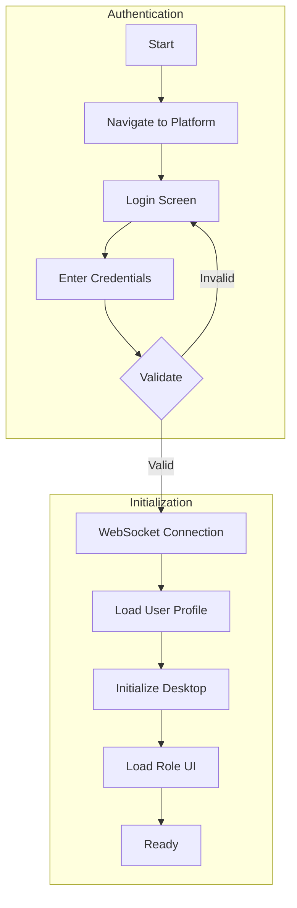
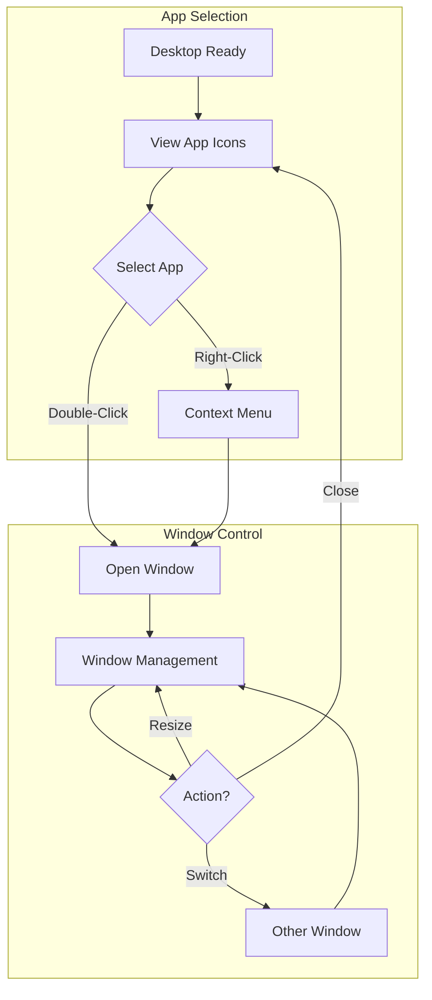
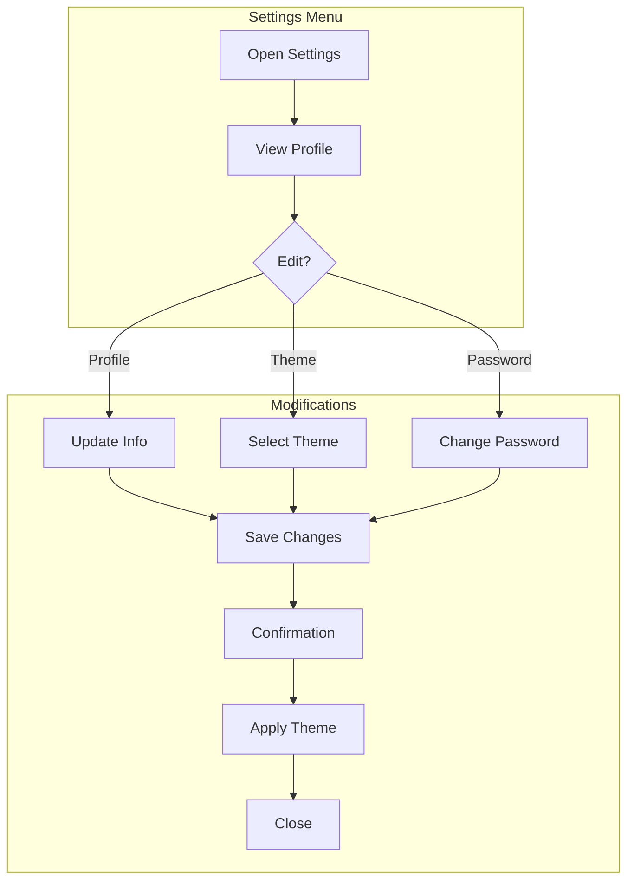
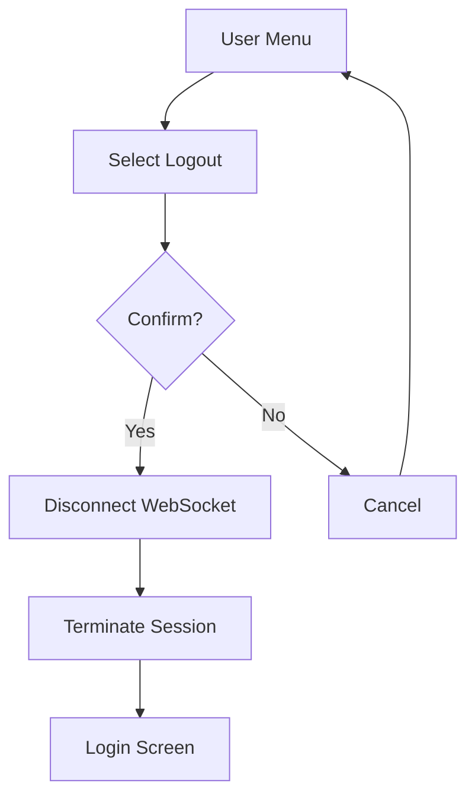
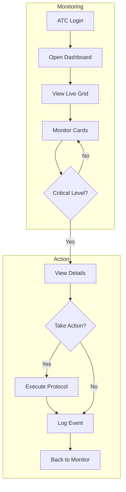
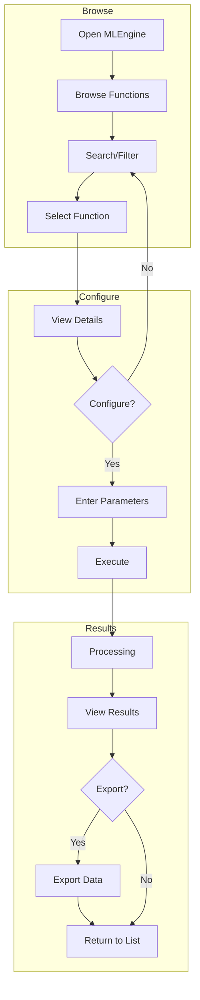
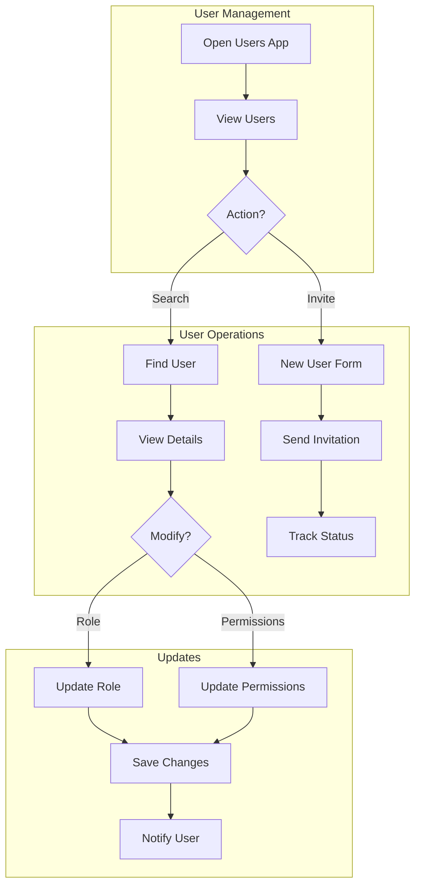
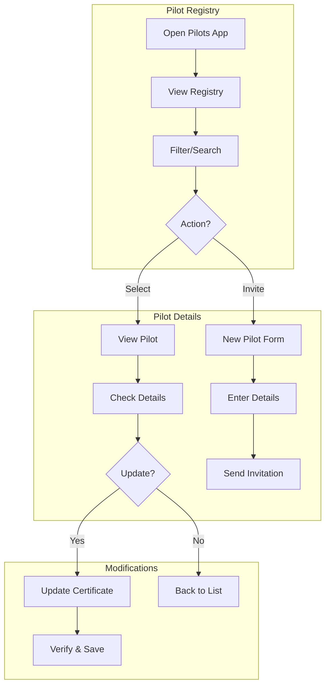
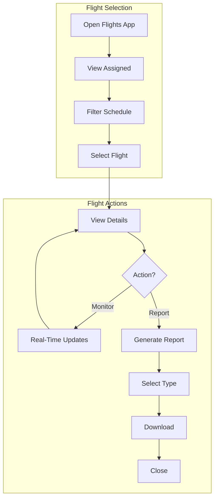
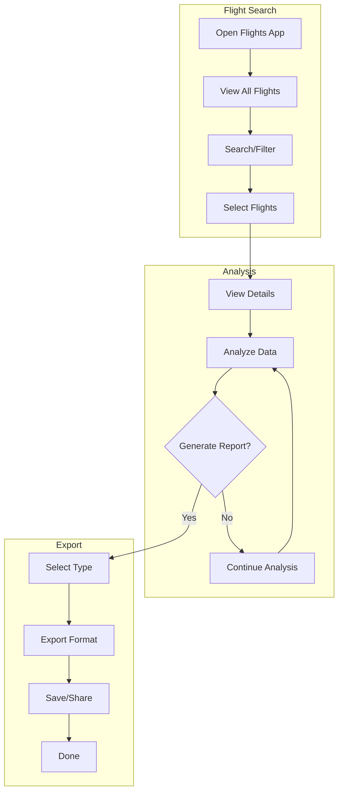

# CogniFlight Cloud Platform - Information Architecture & UX/UI Design Report

## SEN3781 Assignment 4 - Group Project Submission

---

## Executive Summary

CogniFlight Cloud is an advanced aviation management platform that provides a comprehensive desktop-style web application for flight operations, pilot management, and real-time edge node monitoring. This report details the information architecture and UX/UI design for the platform, focusing on creating an intuitive, responsive, and accessible interface that serves four distinct user roles: Air Traffic Controllers (ATC), Pilots, Administrators, and Data Analysts.

The platform leverages a unique desktop paradigm within a web browser, following a desktop-first approach optimized for control center operations and professional aviation management workstations. Each application is designed to perform its specific function independently, ensuring clean separation of concerns and optimal performance.

---

## 1. SITEMAP - System Architecture & Navigation Hierarchy

### 1.1 Overall Platform Structure

```
CogniFlight Cloud Platform
│
├── Authentication Layer
│   ├── Login Screen (Two-Step Authentication)
│   ├── Session Management
│   └── Role-Based Access Control
│
├── Desktop Environment
│   ├── Desktop Canvas
│   │   ├── Application Icons
│   │   ├── Context Menus
│   │   └── Theme Selection (Galaxy/Blue)
│   │
│   ├── Taskbar
│   │   ├── Start Menu
│   │   ├── FATCON Widget (ATC Only - In Design)
│   │   ├── Pinned Applications
│   │   ├── Active Windows
│   │   ├── System Tray
│   │   └── Notification Bell
│   │
│   ├── Window Management System
│   │   ├── Draggable Windows
│   │   ├── Resizable Frames
│   │   ├── Minimize/Maximize/Close
│   │   └── Snap-to-Edge
│   │
│   └── Alert & Notification System
│       ├── System Alerts
│       ├── Toast Notifications
│       ├── Modal Dialogs
│       └── Notification Panel
│
└── Core Applications (Independent Functionality)
    ├── Dashboard
    │   ├── Live Aircraft Grid
    │   ├── Pilot Monitoring Cards
    │   ├── Real-time Edge Node Feeds
    │   ├── Fatigue & Environmental Metrics
    │   └── Priority-Based by Fatigue Level
    │
    ├── MLEngine
    │   ├── Function List
    │   ├── Function Search
    │   ├── Parameter Input
    │   ├── Execution Engine
    │   └── Results Display
    │
    ├── Flights
    │   ├── Flight List
    │   ├── Flight Details
    │   ├── Status Monitoring
    │   ├── Flight History
    │   └── Report Generation
    │
    ├── Pilots
    │   ├── Pilot Registry
    │   ├── Certification Management
    │   ├── Schedule Tracking
    │   ├── Performance Metrics
    │   └── Pilot Invitation
    │
    ├── Users
    │   ├── User Management
    │   ├── Role Assignment
    │   ├── Permission Control
    │   ├── Activity Monitoring
    │   └── User Invitation
    │
    └── Settings
        ├── Profile Configuration
        └── Theme Selection
```

### 1.2 Navigation Hierarchy Levels

**Level 0: Authentication**
- Entry point validation
- Role determination
- Session initialization

**Level 1: Desktop Environment**
- Primary workspace
- Application launcher
- System notifications
- Role-based UI elements

**Level 2: Application Layer**
- Independent applications
- Focused functionality per app
- Self-contained operations

**Level 3: Feature Components**
- App-specific functions
- Specialized operations
- Data management

---

## 2. TASK FLOWS - User Journey Mappings

### 2.1 General Task Flows (All Users)

#### 2.1.1 User Authentication Flow
```
Start → Navigate to Platform URL → Login Screen Displayed
→ Enter Username → Enter Password → Submit Credentials
→ System Validates → WebSocket Connection Established
→ User Profile Loaded (whoami command)
→ Desktop Environment Initialized
→ Role-Specific UI Elements Loaded
→ Ready for Operations
```



**Decision Points:**
- Credential validation
- Session establishment
- Role determination
- UI customization

#### 2.1.2 Desktop Navigation Flow
```
Desktop Loaded → View Available Applications
→ Double-Click App Icon OR Right-Click for Context Menu
→ Application Window Opens → Window Management Options:
  • Drag to Move
  • Resize from Edges
  • Minimize to Taskbar
  • Maximize to Full Screen
  • Close Application
→ Multiple Windows Open → Switch via Taskbar
→ Use Start Menu for Additional Apps
```



**Decision Points:**
- Application selection
- Window arrangement
- Multi-tasking priorities

#### 2.1.3 Settings Configuration Flow
```
Open Settings App → View Current Profile
→ Edit Profile Information (Name, Email, Phone)
→ Select Theme (Blue/Galaxy)
→ Optional: Change Password
→ Save Changes → Confirmation Message
→ Theme Updates Immediately
→ Close Settings
```



**Decision Points:**
- Information accuracy
- Theme preference
- Password update necessity

#### 2.1.4 Logout Flow
```
Click User Menu → Select Logout Option
→ Confirm Logout → WebSocket Disconnected
→ Session Terminated → Return to Login Screen
```



### 2.2 Role-Specific Task Flows

#### 2.2.1 Air Traffic Controller (ATC) Task Flow: Flight Monitoring

```
Login (ATC Role) → Desktop with Enhanced Monitoring Tools
→ Open Dashboard → View Live Aircraft Grid
→ Monitor Pilot Status Cards (Sorted by Fatigue Level)
  → Each Card Shows:
    • Live Pilot Video Feed from Edge Node
    • Fatigue Level Progress Bar
    • Cabin Environmental Data
    • Flight Number & Tail Number
→ Identify Critical Fatigue Levels
→ Click on Critical Flight Card for Detailed View
→ Take Action if Critical Thresholds Exceeded
→ Continue Monitoring Grid
→ Log Critical Events
```



**Decision Points:**
- Fatigue threshold assessment
- Protocol activation timing
- Flight priority decisions
- Resource allocation

#### 2.2.2 Data Analyst Task Flow: ML Analysis Execution

```
Login → Open MLEngine App → View Function List
→ Search for Analysis Function
→ Browse Available Functions → Select Function
→ View Function Details:
  • Description
  • Required Inputs
  • Expected Outputs
→ Enter Parameters:
  • Flight Information
  • Route Details
  • Time Parameters
→ Execute Function → Processing Indicator
→ View Results:
  • Risk Score
  • Category Assessment
  • Contributing Factors
→ Export Results
→ Return to Function List
```



**Decision Points:**
- Function selection based on need
- Parameter completeness
- Result interpretation
- Export format choice

#### 2.2.3 Administrator Task Flow: User Access Management

```
Login → Open Users App → View Active Users
→ Search for Specific User
→ Select User → View Details:
  • Current Role
  • Activity Status
  • Permissions
→ Modify Role Assignment
→ Update Permissions → Save Changes
→ System Sends Notification to User
OR
→ Click "Invite User" → Enter Details:
  • Email Address
  • Proposed Role
→ Send Invitation → Track Pending Status
```



**Decision Points:**
- Role appropriateness
- Permission levels
- Invitation approval
- Activity monitoring needs

#### 2.2.4 Administrator Task Flow: Pilot Registry Management

```
Login → Open Pilots App → View Registry
→ Filter by Availability
→ Select Pilot → View Details:
  • License Information
  • Aircraft Qualifications
  • Flight Hours
  • Current Status
→ Update Certification → Upload New Certificate
→ Verify Expiry Date → Save Changes
OR
→ Click "Invite Pilot" → Enter Details:
  • Name, License, Contact
→ Send Invitation → Await Acceptance
```



**Decision Points:**
- Certification validity
- Pilot availability
- Qualification matching
- Invitation criteria

#### 2.2.5 Pilot Task Flow: Flight Information Access

```
Login → Open Flights App → View Assigned Flights
→ Filter by Personal Schedule
→ Select Flight → View Details:
  • Route Information
  • Aircraft Type
  • Departure Time
  • Current Status
→ Monitor Real-Time Updates
→ Generate Flight Report:
  • Select Report Type
  • Include Relevant Data
→ Download Report
→ Close Flight Details
```



**Decision Points:**
- Flight selection
- Information requirements
- Report type selection
- Export format

#### 2.2.6 Data Analyst Task Flow: Flight Data Analysis

```
Login → Open Flights App
→ View Complete Flight List (All Flights)
→ Use Search and Filter Options:
  • By Date Range
  • By Flight Status
  • By Aircraft
  • By Pilot
→ Select Flights for Analysis
→ View Flight Details:
  • Historical Performance Data
  • Fatigue Patterns
  • Environmental Conditions
→ Generate Reports:
  • Safety Analysis
  • Trend Reports
  • Performance Metrics
→ Export Reports in Various Formats
→ Save or Share Analysis Results
```



**Decision Points:**
- Filter criteria selection
- Threshold configuration
- Monitoring focus
- Data export needs

---

## 3. LOW-FIDELITY WIREFRAMES - Key Interface Designs

### 3.1 Desktop Environment (ATC View)

```
┌─────────────────────────────────────────────────────────────────────────────┐
│ CogniFlight Cloud Desktop - Air Traffic Controller                 - □ X    │
├─────────────────────────────────────────────────────────────────────────────┤
│                                                                              │
│                                                                              │
│                                                                              │
│  Desktop Icons:                                                             │
│  ┌──────┐  ┌──────┐  ┌──────┐  ┌──────┐  ┌──────┐  ┌──────┐              │
│  │ Dash │  │  ML  │  │Flight│  │Pilots│  │Users │  │ Set  │              │
│  │board │  │Engine│  │      │  │      │  │      │  │tings │              │
│  └──────┘  └──────┘  └──────┘  └──────┘  └──────┘  └──────┘              │
│                                                                              │
├─────────────────────────────────────────────────────────────────────────────┤
│[Start]│[Status: Normal]│Dashboard│MLEngine│Flights│        🔔(5) 10:24 AM  │
└─────────────────────────────────────────────────────────────────────────────┘
         ↑
    Status indicator (FATCON widget in design phase)
```

### 3.2 Desktop Environment (Regular User View)

```
┌─────────────────────────────────────────────────────────────────────────────┐
│ CogniFlight Cloud Desktop                                          - □ X    │
├─────────────────────────────────────────────────────────────────────────────┤
│                                                                              │
│  Desktop Icons:                                                             │
│  ┌──────┐  ┌──────┐  ┌──────┐  ┌──────┐  ┌──────┐  ┌──────┐              │
│  │ Dash │  │  ML  │  │Flight│  │Pilots│  │Users │  │ Set  │              │
│  │board │  │Engine│  │      │  │      │  │      │  │tings │              │
│  └──────┘  └──────┘  └──────┘  └──────┘  └──────┘  └──────┘              │
│                                                                              │
│                                                                              │
│                                                                              │
│                                                                              │
│                                                                              │
│                                                                              │
│                                                                              │
├─────────────────────────────────────────────────────────────────────────────┤
│ [Start] │ Dashboard │ MLEngine │ Flights │               🔔(2) 10:24 AM    │
└─────────────────────────────────────────────────────────────────────────────┘
```

### 3.3 Dashboard Application

```
┌─────────────────────────────────────────────────────────────────────────────┐
│ Dashboard - Live Aircraft Monitoring                              - □ X   │
├─────────────────────────────────────────────────────────────────────────────┤
│ Active Flights | Critical | Warning | Normal                               │
├─────────────────────────────────────────────────────────────────────────────┤
│                                                                              │
│ ┌──────────────────┐  ┌──────────────────┐  ┌──────────────────┐         │
│ │ CF1234 🔴        │  │ CF1235 🟡        │  │ CF1236 🟡        │         │
│ │ ┌──────────────┐ │  │ ┌──────────────┐ │  │ ┌──────────────┐ │         │
│ │ │ 📹 Live Feed │ │  │ │ 📹 Live Feed │ │  │ │ 📹 Live Feed │ │         │
│ │ │              │ │  │ │              │ │  │ │              │ │         │
│ │ │  Pilot Image │ │  │ │  Pilot Image │ │  │ │  Pilot Image │ │         │
│ │ │              │ │  │ │              │ │  │ │              │ │         │
│ │ └──────────────┘ │  │ └──────────────┘ │  │ └──────────────┘ │         │
│ │ Pilot: J. Smith  │  │ Pilot: M. Brown  │  │ Pilot: S. Lee    │         │
│ │ Fatigue: ███░ 85%│  │ Fatigue: ██░░ 65%│  │ Fatigue: ██░░ 55%│         │
│ │ Temp: 22°C       │  │ Temp: 21°C       │  │ Temp: 23°C       │         │
│ │ Humidity: 45%    │  │ Humidity: 50%    │  │ Humidity: 48%    │         │
│ │ Pressure: 1013mb │  │ Pressure: 1012mb │  │ Pressure: 1014mb │         │
│ │ [View Details]   │  │ [View Details]   │  │ [View Details]   │         │
│ └──────────────────┘  └──────────────────┘  └──────────────────┘         │
│                                                                              │
│ ┌──────────────────┐  ┌──────────────────┐  ┌──────────────────┐         │
│ │ CF1237 🟢        │  │ CF1238 🟢        │  │ CF1239 🟢        │         │
│ │ ┌──────────────┐ │  │ ┌──────────────┐ │  │ ┌──────────────┐ │         │
│ │ │ 📹 Live Feed │ │  │ │ 📹 Live Feed │ │  │ │ 📹 Live Feed │ │         │
│ │ │              │ │  │ │              │ │  │ │              │ │         │
│ │ │  Pilot Image │ │  │ │  Pilot Image │ │  │ │  Pilot Image │ │         │
│ │ │              │ │  │ │              │ │  │ │              │ │         │
│ │ └──────────────┘ │  │ └──────────────┘ │  │ └──────────────┘ │         │
│ │ Pilot: R. Wilson │  │ Pilot: K. Chen   │  │ Pilot: A. Garcia │         │
│ │ Fatigue: █░░░ 35%│  │ Fatigue: █░░░ 30%│  │ Fatigue: █░░░ 25%│         │
│ │ Temp: 20°C       │  │ Temp: 22°C       │  │ Temp: 21°C       │         │
│ │ Humidity: 42%    │  │ Humidity: 46%    │  │ Humidity: 44%    │         │
│ │ Pressure: 1015mb │  │ Pressure: 1013mb │  │ Pressure: 1014mb │         │
│ │ [View Details]   │  │ [View Details]   │  │ [View Details]   │         │
│ └──────────────────┘  └──────────────────┘  └──────────────────┘         │
│                                                                              │
│ Grid sorted by fatigue level (highest first) • Live data streaming        │
└─────────────────────────────────────────────────────────────────────────────┘
```

### 3.4 Dashboard Flight Detail View (After Clicking a Card)

```
┌─────────────────────────────────────────────────────────────────────────────┐
│ Dashboard - Flight CF1234 Details                                 - □ X   │
├─────────────────────────────────────────────────────────────────────────────┤
│ [← Back to Grid]                           Fatigue Level: CRITICAL 🔴 85%  │
├─────────────────────────────────────────────────────────────────────────────┤
│                                                                              │
│ Live Edge Node Feed                     Pilot Biometric Data                │
│ ┌────────────────────────────┐         ┌────────────────────────────┐     │
│ │                            │         │ Pilot: J. Smith             │     │
│ │                            │         │                             │     │
│ │      📹 Live Video         │         │ Fatigue Level               │     │
│ │      From Edge Node        │         │ ████████████████░░░░ 85%   │     │
│ │                            │         │                             │     │
│ │    [Pilot View from        │         │ Cabin Temperature           │     │
│ │     Cockpit Camera]        │         │ 22°C [Normal Range]         │     │
│ │                            │         │                             │     │
│ │                            │         │ Humidity                    │     │
│ │                            │         │ 45% [Optimal]               │     │
│ │                            │         │                             │     │
│ │                            │         │ Cabin Pressure              │     │
│ │                            │         │ 1013 mb [Standard]          │     │
│ └────────────────────────────┘         └────────────────────────────┘     │
│                                                                              │
│ Flight Information                      Alerts & Warnings                   │
│ ┌────────────────────────────┐         ┌────────────────────────────┐     │
│ │ Flight: CF1234             │         │ ⚠ High fatigue detected     │     │
│ │ Route: JFK → LAX           │         │ ⚠ Eye tracking: Drowsy      │     │
│ │ Aircraft: A320-214         │         │ ℹ Recommend crew rotation   │     │
│ │ Departure: 14:30           │         │                             │     │
│ │ ETA: 17:45                 │         │ Heart Rate: 72 bpm          │     │
│ │ Altitude: 35,000 ft        │         │ Stress Level: Medium        │     │
│ │ Speed: 485 kts             │         │                             │     │
│ └────────────────────────────┘         └────────────────────────────┘     │
│                                                                              │
│ Historical Trends (Last 24 Hours)                                          │
│ ┌──────────────────────────────────────────────────────────────────┐      │
│ │ Fatigue Trend:  ▁▂▃▄▅▆▇█ (Increasing - Critical Level)          │      │
│ │ Environmental: Stable cabin conditions throughout flight           │      │
│ │ Alerts: 3 fatigue warnings in past 4 hours                       │      │
│ └──────────────────────────────────────────────────────────────────┘      │
│                                                                              │
│ [Contact Pilot] [Request Relief Crew] [Export Data] [Generate Report]      │
└─────────────────────────────────────────────────────────────────────────────┘
```

### 3.5 MLEngine Application

```
┌─────────────────────────────────────────────────────────────────────────────┐
│ MLEngine                                                           - □ X   │
├─────────────────────────────────────────────────────────────────────────────┤
│                                                                              │
│  [Search functions...                                                   🔍] │
│                                                                              │
│  Filter: [All Categories ▼]  Sort: [Name ▼]                               │
│                                                                              │
├─────────────────────────────────────────────────────────────────────────────┤
│                                                                              │
│  ┌────────────────────────────────────────────────────────────────┐        │
│  │ Risk Analysis                                                  │        │
│  │ Comprehensive safety risk assessment for flights               │        │
│  │                                                          [View>]│        │
│  └────────────────────────────────────────────────────────────────┘        │
│                                                                              │
│  ┌────────────────────────────────────────────────────────────────┐        │
│  │ Route Optimization                                              │        │
│  │ Calculate optimal flight paths based on multiple factors       │        │
│  │                                                          [View>]│        │
│  └────────────────────────────────────────────────────────────────┘        │
│                                                                              │
│  ┌────────────────────────────────────────────────────────────────┐        │
│  │ Weather Prediction                                              │        │
│  │ Advanced weather forecasting for flight planning               │        │
│  │                                                          [View>]│        │
│  └────────────────────────────────────────────────────────────────┘        │
│                                                                              │
│  Functions List                                              [Load More]  │
└─────────────────────────────────────────────────────────────────────────────┘
```

### 3.6 MLEngine Function Detail View

```
┌─────────────────────────────────────────────────────────────────────────────┐
│ MLEngine - Risk Analysis                                          - □ X   │
├─────────────────────────────────────────────────────────────────────────────┤
│ [← Back to Functions]                                                       │
├─────────────────────────────────────────────────────────────────────────────┤
│                                                                              │
│ Description:                                                                │
│ Comprehensive safety risk assessment for flights based on multiple          │
│ factors including weather, traffic, aircraft condition, and route.          │
│                                                                              │
│ Input Parameters:                                                           │
│                                                                              │
│ Flight ID *         [_____________________________________________]         │
│ Departure Airport * [_____________________________________________]         │
│ Arrival Airport *   [_____________________________________________]         │
│ Departure Time *    [_____________________________________________]         │
│ Aircraft Type       [_____________________________________________]         │
│                                                                              │
│ Expected Output:                                                            │
│ • Risk Score (0-100)                                                       │
│ • Risk Category (Low/Medium/High/Critical)                                 │
│ • Contributing Factors                                                      │
│ • Recommendations                                                           │
│                                                                              │
│                            [Execute Function]                              │
└─────────────────────────────────────────────────────────────────────────────┘
```

### 3.7 Flights Application

```
┌─────────────────────────────────────────────────────────────────────────────┐
│ Flights                                                            - □ X   │
├───────┬────────┬───────────┬──────────────────────────────────────────────┤
│ Live  │ History │ Reports   │                                              │
├───────┴────────┴───────────┴──────────────────────────────────────────────┤
│ [Search: _______________] [Filter ▼] [Export] [Generate Report]            │
├─────────────────────────────────────────────────────────────────────────────┤
│                                                                              │
│ ┌─┬────────┬──────────┬────────┬────────┬─────────┬────────┬──────┬─────┐│
│ │□│Flight  │Route     │Depart  │Arrive  │Aircraft │Pilot   │Status│Risk ││
│ ├─┼────────┼──────────┼────────┼────────┼─────────┼────────┼──────┼─────┤│
│ │□│CF1234  │JFK → LAX │14:30   │17:45   │A320-214 │Smith.J │En Air│ Low ││
│ │□│CF1235  │LAX → ORD │15:45   │21:30   │B737-800 │Doe.J   │Board │ Med ││
│ │□│CF1236  │ORD → DFW │16:20   │18:45   │A321-200 │Wilson.R│Ready │ Low ││
│ │□│CF1237  │DFW → ATL │17:00   │20:15   │B757-200 │Brown.M │Sched │ Low ││
│ └─┴────────┴──────────┴────────┴────────┴─────────┴────────┴──────┴─────┘│
│                                                                              │
│ [View Details] [Monitor] [Generate Report] [Export Data]                   │
│                                                                              │
│ All Flights                                                              │
└─────────────────────────────────────────────────────────────────────────────┘
```

### 3.8 Pilots Application

```
┌─────────────────────────────────────────────────────────────────────────────┐
│ Pilots                                                             - □ X    │
├─────────────────────────────────────────────────────────────────────────────┤
│ [+ Invite Pilot] [Import] [Export] [Search: _____________]                 │
│ Filter: [All ▼] [Available ▼] [Certified ▼] [Base ▼]                      │
├─────────────────────────────────────────────────────────────────────────────┤
│                                                                              │
│ Total: 156 | Available: 42 | On Duty: 89 | Rest: 25                       │
│                                                                              │
│ ┌─┬──────────────┬────────┬───────────┬──────────┬─────────┬──────┬──────┐│
│ │□│Name          │License │Aircraft   │Hours     │Status   │Base  │Action││
│ ├─┼──────────────┼────────┼───────────┼──────────┼─────────┼──────┼──────┤│
│ │□│John Smith    │ATP-234 │A320, A350 │8,542     │Available│JFK   │[View]││
│ │□│Jane Doe      │CPL-567 │B737, B757 │3,256     │On Duty  │LAX   │[View]││
│ │□│Bob Wilson    │ATP-890 │A320, A380 │12,450    │Rest     │ORD   │[View]││
│ │□│Alice Brown   │CPL-123 │B737       │2,100     │Available│DFW   │[View]││
│ │□│Mike Johnson  │ATP-456 │A350, B777 │9,800     │On Duty  │ATL   │[View]││
│ └─┴──────────────┴────────┴───────────┴──────────┴─────────┴──────┴──────┘│
│                                                                              │
│ [View Selected] [Update Status] [Generate Report]                          │
│                                                                              │
│ All Pilots                                                               │
└─────────────────────────────────────────────────────────────────────────────┘
```

### 3.9 Users Application

```
┌─────────────────────────────────────────────────────────────────────────────┐
│ Users                                                              - □ X    │
├─────────────────────────────────────────────────────────────────────────────┤
│ [+ Invite User] [Import] [Export] [Search: _____________] [Filter: All ▼]  │
├─────────────────────────────────────────────────────────────────────────────┤
│                                                                              │
│ Active: 87 | Pending: 3 | Inactive: 12                                     │
│                                                                              │
│ ┌─┬──────────────┬──────────────────┬──────────┬─────────┬──────┬───────┐│
│ │□│Name          │Email             │Role      │Status   │Last  │Actions││
│ ├─┼──────────────┼──────────────────┼──────────┼─────────┼──────┼───────┤│
│ │□│John Smith    │j.smith@cf.com    │ATC       │Active   │2 hrs │[⋮]   ││
│ │□│Jane Doe      │j.doe@cf.com      │Admin     │Active   │5 min │[⋮]   ││
│ │□│Bob Wilson    │b.wilson@cf.com   │Analyst   │Active   │1 day │[⋮]   ││
│ │□│Alice Brown   │a.brown@cf.com    │Pilot     │Active   │3 hrs │[⋮]   ││
│ └─┴──────────────┴──────────────────┴──────────┴─────────┴──────┴───────┘│
│                                                                              │
│ [Change Role] [Deactivate] [Reset Password]                                │
│                                                                              │
│ All Users                                                                │
└─────────────────────────────────────────────────────────────────────────────┘
```

### 3.10 Settings Application

```
┌─────────────────────────────────────────────────────────────────────────────┐
│ Settings                                                           - □ X   │
├─────────────────────────────────────────────────────────────────────────────┤
│                                                                              │
│  Profile Configuration                                                      │
│                                                                              │
│  Full Name:         [John Doe_______________________________________]       │
│  Email:             [john.doe@cogniflight.com______________________]       │
│  Phone:             [+1 555-0123____________________________________]       │
│  Department:        [Operations ▼]                                          │
│  Role:              ATC (read-only)                                         │
│                                                                              │
│  Change Password                                                            │
│  Current Password:  [••••••••••••••••••••••••••••••••________________]       │
│  New Password:      [_______________________________________________]       │
│  Confirm Password:  [_______________________________________________]       │
│                                                                              │
│  Theme Selection                                                            │
│  ( ) Blue Theme - Classic professional interface                            │
│  (•) Galaxy Theme - Modern dark theme with space-inspired visuals          │
│                                                                              │
│  [Save Changes] [Cancel]                                                    │
│                                                                              │
└─────────────────────────────────────────────────────────────────────────────┘
```

---

## 4. RESPONSIVE DESIGN STRATEGY

### 4.1 Desktop-First UI Optimization

**Target Display Environments:**
```css
/* Desktop-First Breakpoints */
- Control Center: 2560px+ (4K monitors)
- Workstation: 1920px - 2559px  
- Standard: 1280px - 1919px
- Compact: 1024px - 1279px
- Tablet: 768px - 1023px (Emergency only)
```

### 4.2 Window Management & UI Flexibility

**Resizable Windows:**
- All application windows support dynamic resizing from edges and corners
- Minimum window sizes enforce usability (800x600px default)
- Content reflows intelligently as windows resize
- Scrollbars appear automatically when content exceeds viewport

**Window Snap Zones:**
- **Drag to Top**: Maximize window to full screen
- **Drag to Left**: Snap to exactly 50% width on left side
- **Drag to Right**: Snap to exactly 50% width on right side
- Double-click title bar to maximize/restore
- Windows remember last position and size when reopened

### 4.3 Responsive Application UI

**Adaptive Components:**
- **Grid Layouts**: Dashboard cards automatically reflow based on window width
  - 4K displays: 6+ cards per row
  - Full HD: 4 cards per row  
  - Compact: 2-3 cards per row
  
- **Tables**: Column visibility adapts to available width
  - Essential columns always visible
  - Secondary columns hide at smaller widths
  - Horizontal scroll for data integrity

- **Forms**: Responsive field layouts
  - Wide screens: Multi-column forms
  - Narrow screens: Single column stack
  - Labels position dynamically (side vs. top)

- **Navigation**: Collapsible menus and toolbars
  - Full toolbar at standard widths
  - Icon-only mode at compact widths
  - Dropdown overflow menu for hidden items

### 4.4 Typography & Spacing

**Scalable UI Elements:**
- Base font size: 14px (desktop) to 16px (4K)
- Touch targets: Minimum 44x44px click areas
- Padding scales proportionally with viewport
- Line height adjusts for readability
- Icon sizes scale with interface density

---

## CONCLUSION

The CogniFlight Cloud platform delivers a sophisticated aviation management system with specialized applications for distinct operational needs. The platform employs a desktop-first approach with role-based access control, ensuring each user type has access to the appropriate tools and information for their responsibilities.

Key design principles:
- **Independent Applications**: Each app performs one function excellently
- **No Inter-App Dependencies**: Clean separation of concerns
- **Role-Based Features**: UI adapts to four distinct user roles (ATC, Pilot, Admin, Data Analyst)
- **Professional Desktop Environment**: Optimized for control center operations
- **Scalable Architecture**: Designed to accommodate future enhancements and features

This architecture ensures that all users can effectively manage their specific operational tasks through dedicated, purpose-built applications while maintaining system security and performance.

---

**Document Version:** 1.0  
**Last Updated:** September 2024  
**Project Team:** CogniFlight Development Team  
**Course:** SEN3781 - Software Engineering  
**Institution:** Belgium Campus iTversity