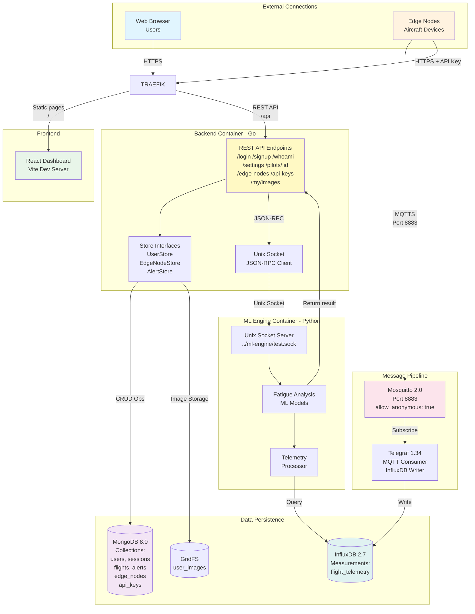

# Project Assignment 3: System Architecture Design

**Module:** SEN381  
**Assessment:** Assignment 3
**Total Marks:** 25  
**Team:** PTA-AVIATION_PROJECT  
**Date:** September 2025  

## 1. System Design

### Chosen architecture: Service-Oriented Architecture (SOA)

Service-Oriented architecture allows us to manage and deploy separate interdependent services.
When combined with Docker, it provides a way for us to glue together different technologies according to the best solutions for designated problems.

For example, in our case it enables us to use Python for ML-enabled behavior such as generating face-embeddings or predicting pilot fatigue, and Go for concurrent REST API service implementation. This means we pick the best technology to solve every sub-problem so that we create a coherent system capable of ambitious behavior, albeit with extra code-maintenance overhead for integration and control.

### Component interactions & data flow

We host a Traefik reverse proxy on the server that redirects connections to our backend and frontend. The frontend is simply served as static files to the user, while the backend is a server-side REST API that interacts with our 2 databases and ml-engine to perform any required high-performance operations.

The server also hosts our own MQTT message broker for telemetry data connections, as discussed in the technology stack.

### Technology stack

| Layer | Technology | Purpose |
|-------|------------|---------|
| **Backend** | Go 1.24.2 | High-performance API endpoints |
| **Frontend** | React 19.1 + Vite | Interactive dashboard |
| **ML Engine** | Python 3.12.3+ | Fatigue analysis algorithms |
| **Database** | MongoDB 8.0 | Operational data storage |
| **Time-Series** | InfluxDB 2.7 | Telemetry data storage |
| **Message Broker** | Mosquitto 2.0 | Real-time MQTT data streaming |
| **Metrics Collection** | Telegraf 1.34 | Data pipeline processing |
| **Containerization** | Docker Compose | Service orchestration |

**Technology stack justification**:

| Technology | Justification |
|------------|---------------|
| **Go 1.24.2** | Go excels in codebase scalability and concurrent performance for general service communications. Thus, it fits this project perfectly due to its integral role and performance characteristics |
| **React 19.1** | Our frontend will be a React Single-Page-Application (SPA). This simplifies state management for this segregated architecture (as the front-end is loose), and also provides effective caching mechanisms so that long-time visitors have a better user-experience. |
| **Python 3.12.3+** | For ML-operations, we need Python so that it lines up with code implementation on the edge-node. It is also simply the prime choice for ML inference. |
| **MongoDB 8.0** | MongoDB's flexible document-oriented architecture and ease of scalability makes it a prime choice for general-purpose data storage for this system. |
| **InfluxDB 2.7** | InfluxDB is optimised for time-series data storage, and also houses a user-friendly dashboard for outside inspection and CLI tools, for easy interactions. |
| **Mosquitto 2.0** | Housing our own broker simplifies connection and deployment. |
| **Telegraf 1.34** | Telegraf relieves us of the responsibility to write the code that stores our MQTT messages in InfluxDB |
| **Docker Compose** | For SOA, `docker compose` is perfect, because it enables once-off deployment of all services with configuration options that are defined in an environment-agnostic, version-controllable way. |

## 2. Architectural design pattern

As mentioned earlier, we use a Service-Oriented Architecture (SOA). This is further detailed in the following diagram and descriptions

### Architecture diagram

From this graph you can see that our deployment houses 2 main entrypoints, namely HTTPS over port 443 and MQTTS over port 8883.

We use Traefik as our reverse proxy on the host, so that TLS certificates are automatically managed externally, and so that our docker-compose spec doesn't have to house the reverse proxy behavior between different systems if there is already such a system-wide proxy available.

The backend serves as a central orchestrator and control mechanism that all information flows past and is overseen by. For instance, it calls the ml-engine over JSON-RPC, and when an edge node connects to our MQTT broker, the broker consults the backend for authorization status. It is also consulted by the frontend from the user's browser for authentication and dashboard-relevant services, and will later serve as the middleman between the browser and OpenAI for our chatbot integration.

We use MongoDB for most data storage, including hashed user credentials, sessions and flights. InfluxDB is then exposed for telemetry data storage, and is continuously accessed by Telegraf to store incoming message streams from our message broker. InfluxDB also exposes a dashboard for data-exploration that will be available for debugging and inspection during development.

### Service separation

The main benefit of this architecture, is that we can easily split up the problem into different sub-problems, and solve every one of them with the best domain-specific solution. Docker enables us to attribute automatic deployment and management processes to this. We then connect the different services with specific IPC protocols, namely HTTP, MQTT, and Unix sockets.

### Inter-service communication patterns

Our architecture is heavily request-response oriented. The only event-driven (message) part would be our MQTT connections, but the rest of the system uses request-based protocols. For example, most requests to the API will be in the form of simple HTTP requests, which have a defined request and response body. And the API also interacts with the ML engine with JSON-RPC, which also dictates specific requests and responses.

## 3. Design patterns

| Pattern | Implementation | Purpose |
|---------|---------------|---------|
| **Repository** | UserStore, EdgeNodeStore | Data access abstraction |
| **Factory** | Session creation | Object instantiation control |
| **Observer** | Alert notification | Event-driven updates |
| **Strategy** | Role-based permissions | Behavior variation |
| **Singleton** | Database connection | Resource management |

## 4. Justification of chosen Architecture (SOA)

1. **Separation of concerns** - SOA allows you to solve sub-problems with their own services, and couple them in the way that best suits the problem at hand
2. **Scalability** - It will be simple to scale the system horizontally and vertically later if necessary, but would just require some unique configuration
3. **Interoperability** - SOA enables different technologies to integrate across well-defined IPC interfaces, often in ways that aren't traditionally trivial but could broaden the ambitions of the project's scope.
4. **Reusability** - The services developed during SOA implementation can also be continuously integrated with more services as the system scales. This is particularly useful for large, enterprise-scale systems, where SOA originated.
5. **Easier maintenance & Evolution** - Services are semi-independent, enabling piece-wise experimentation and updates, and cooperation with teams split between different services.
6. **Technology flexibility** - SOA enables you to connect different technologies that normally don't work well together. For example, in this case we have Go, React and Python working together.
7. **Configurability** - SOA is a very broad architecture term, allowing creative intervention, often simplifying large-scale projects.
